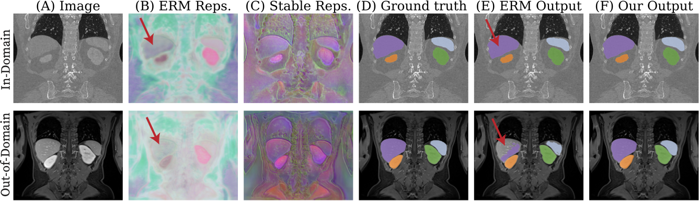

# Why Invariance is Not Enough for Biomedical Domain Generalization and How to Fix It

<p align="center">
  
</p>

This is the reference implementation for `DropGen`. Please see the instructions below on how to use the codebase.

If you have any questions about the paper, please contact `sdd@mit.edu`. If you encounter issues with the repo, please open an issue. Thanks!

## Table of Contents
- [To-Do](#to-do)
- [Requirements](#requirements)
- [Setup](#setup)
- [Dataset Setup](#dataset-setup)
- [Usage](#usage)
- [Code Organization](#code-organization)
- [File Structure](#file-structure)


## To-Do
- [ ] Implement with nnUNet.

## Requirements
- Please see the `pyproject.toml` file.
- Do not use PyTorch 2.9.0 due to performance degradations in 3D convolutions.
- We use WandB to manage training runs.

## Setup

We use [`uv`](https://docs.astral.sh/uv/) to manage dependencies. To get started:

1. **Install `uv`** (if you don't have it already):
   ```bash
   curl -LsSf https://astral.sh/uv/install.sh | sh
   ```

2. **Clone the repository and install dependencies:**
   ```bash
   git clone https://github.com/sebodiaz/DropGen.git && cd DropGen
   uv sync
   ```

   This will create a virtual environment and install all dependencies specified in `pyproject.toml`.

3. **Download the feature extractor**:
To download the feature extractor, `cd` into this repository's main folder and use the following command:
    ```bash
    wget -O pretrained/anatomix.pth https://raw.githubusercontent.com/neel-dey/anatomix/main/model-weights/anatomix.pth
    ```

4. (*Optional*) **Log in to WandB**:
   ```bash
   uv run wandb login
   ```

You can now launch training runs with `uv run main.py` (see [Usage](#usage)).

## Dataset Setup

Organize your dataset in the following [nnUNet-style](https://github.com/MIC-DKFZ/nnUNet/blob/master/documentation/dataset_format.md) directory structure and pass the root path via `--data_dir`:

```
/path/to/your/dataset/
├── imagesTr/
│   ├── subject001_0000.nii.gz
│   ├── subject002_0000.nii.gz
│   └── ...
├── labelsTr/
│   ├── subject001.nii.gz
│   ├── subject002.nii.gz
│   └── ...
├── imagesVal/
│   ├── subject050_0000.nii.gz
│   └── ...
├── labelsVal/
│   ├── subject050.nii.gz
│   └── ...
├── imagesTs/          # optional
│   └── ...
└── labelsTs/          # optional
    └── ...
```

**Naming convention:**
- **Images** use the nnUNet channel suffix: `<subject>_0000.nii.gz` (use `_0000` for single-channel volumes).
- **Labels** match by subject name without the channel suffix: `<subject>.nii.gz`.
- For multi-channel inputs (e.g., multi-modal MRI), use `_0000`, `_0001`, etc. for each channel.
- Subject names can be arbitrary but must be consistent between images and labels.

**Notes:**
- If `imagesTs/` and `labelsTs/` are not present, the test split is skipped.
- Data is automatically resampled to the target spacing specified by `--spacing` (or the dataset default). Resampled volumes are cached on disk so this only happens once.

### Custom Splits via CSV

Instead of relying on the directory structure for splits, you can provide a CSV file via `--split_csv` to explicitly assign subjects to train/val/test with their image and label paths:

```csv
image,label,split
/path/to/subject001_0000.nii.gz,/path/to/subject001.nii.gz,train
/path/to/subject002_0000.nii.gz,/path/to/subject002.nii.gz,train
/path/to/subject050_0000.nii.gz,/path/to/subject050.nii.gz,val
/path/to/subject060_0000.nii.gz,/path/to/subject060.nii.gz,test
```

This requires `--data_dir` to be set (used for storing resampled volumes).

## Usage
Below are some examples on how to launch a training run using `uv`. The specific arguments are examples of what you _could_ run. See `options.py` for more flexibility / customizability.

```bash
uv run main.py \
    --run_name dropgen_hvsmr \
    --data_dir /path/to/your/dataset \
    --dataset hvsmr \
    --method dropgen \
    --dropout_prob 0.75 \
    --max_steps 250_000 \
    --eval_interval 1_000
```

Additionally, if you want to train in the "few-shot" regime, use the `--num_subjects` and `--max_steps` flags:

```bash
uv run main.py \
    --run_name dropgen_hvsmr_fewshot \
    --data_dir /path/to/your/dataset \
    --dataset hvsmr \
    --method dropgen \
    --dropout_prob 0.75 \
    --num_subjects 5 \
    --max_steps 40_000
```

The `--num_subjects` flag limits training to only N randomly selected subjects. You can also provide a CSV for explicit split control:

```bash
uv run main.py \
    --run_name dropgen_hvsmr_fewshot \
    --data_dir /path/to/your/dataset \
    --dataset hvsmr \
    --method dropgen \
    --dropout_prob 0.75 \
    --num_subjects 5 \
    --max_steps 40_000 \
    --split_csv /path/to/splits.csv
```

## Code Organization
When a training run is launched, a folder is created in a `./runs/` directory. For example, if you launch a run with the name `dropgen_hvsmr`, the run directory would be `./runs/dropgen_hvsmr`. In this directory, three files are created throughout training: `best.pth`, `latest.pth`, and `val_history.json`.

## File Structure
```
DropGen/
├── README.md
├── pyproject.toml          # project dependencies
├── main.py                 # entry point — training, validation, and testing
├── options.py              # argument parsing and run configuration
├── src/
│   ├── augmentations.py    # MONAI-based augmentation pipeline
│   ├── data.py             # data processing: train, val, test splits
│   ├── losses.py           # loss function definitions
│   ├── misc.py             # utility functions (checkpointing, logging, etc.)
│   └── network.py          # U-Net architecture
└── runs/
    └── <run_name>/
        ├── best.pth
        ├── latest.pth
        └── val_history.json
```
